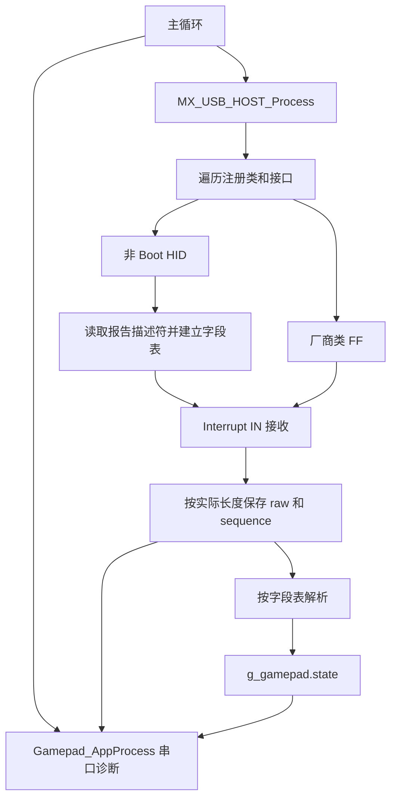

# 首版实现与接口

[返回文档目录](README.md)

以当前源码为准；本页描述已实现的软件行为，不代表 KP50 实机兼容性结论。

## 模块与接入

- `gamepad_hid.c/.h`：独立于 STM32 的有界 HID 解析器。识别 Joystick/Game Pad Application Collection，处理 Report ID、Input 位偏移、常量填充、Usage 列表/范围、Global Push/Pop、有符号字段、4/8 方向帽及中立值。
- `host_gamepad.c/.h`：独立 Host 类，优先非 Boot HID，其次 class=FF 的厂商接口。只读取一个接口的一个 Interrupt IN 端点，使用其实际 MPS 和 bInterval。控制请求的 wIndex 使用 bInterfaceNumber，收包使用实际传输长度。
- `gamepad_app.c`：USART2 非阻塞诊断，Keil Watch 可同时观察 `g_gamepad`。
- `usb_host.c` 已注册新类，`main.c` 已调用新诊断入口。旧 `host_mouse.c` 保留但从本次 Keil 编译中排除，旧键鼠 HID 类没有注册。
- USB Core 的类选择改为遍历已注册类与已解析接口，不再只看接口 0；配置容量为 8 个接口、每接口 4 个端点、2 个注册类。

标准 HID 解析受限或失败时保留 RAW，`descriptor_status=-1`；没有识别到手柄字段或厂商接口为 0；成功建表为 1。不会用一套固定偏移强行解释未知设备。

## 能力边界

- 固定容量：输入包最多 64 字节、报告描述符 1024 字节、配置描述符 512 字节、最多 8 个 Report ID、64 个映射字段、32 个按钮、9 个轴、1 个方向帽。
- 只映射绝对值 Variable 输入。Array、相对字段、Long Item、Usage Delimiter、重复同名控件和超限布局会退回 RAW，避免产生错误控制值。短包不会部分更新状态；出错后清空解析状态。
- 复合设备默认选第一个符合条件的非 Boot HID 接口。它可能只是厂商配置接口，尚不自动遍历所有报告描述符寻找最佳手柄接口。查看 CFG 后，可在 `host_gamepad.h` 将 `GAMEPAD_INTERFACE_NUMBER` 改成实际接口号；该限制同时作用于 HID 和厂商类。
- class=FF 只支持被动 Interrupt IN 采集，未实现 Xbox/GIP/厂商握手。若需要初始化命令才上报，本版可能只有描述符而没有 RAW。这时需要接收器 VID/PID 和 PC 侧 USB 抓包继续适配。
- 不支持 USB Hub、多手柄同时接入、蓝牙直连、震动和灯光输出。
- 正常 NAK 按 bInterval 重试，STALL 使用 CLEAR_FEATURE 后恢复 DATA0。清除失败或 IN 传输持续 1 秒未完成时停止该端点、清空控制状态，通过 STATUS 报告，重新插拔恢复。

后续适配请保留开机到连接的全部日志，并注明 KP50 初代/二代、当前模式和每段 RAW 对应的动作。若 `PAD class=FF` 或 `map=0/-1`，先看接口与原始包，不急着写死偏移。

## 数据流

当前没有输入历史队列。主循环每收到有效长度的非空包就更新 RAW 快照；诊断再定期采样最新快照。需要逐包捕获短暂动作或握手时，应另行增加完整采集路径或使用 PC USB 抓包。

## 对外接口

源文件：[host_gamepad.h](../Lib/host_gamepad/host_gamepad.h)、[gamepad_hid.h](../Lib/host_gamepad/gamepad_hid.h)。

| 接口/对象 | 语义 |
| --- | --- |
| `GamepadHID_Class` / `GamepadRaw_Class` | 注册的两个 Host 类，共享单接收器传输状态 |
| `Gamepad_AppProcess(host)` | 主循环调用；非阻塞发送诊断并处理日志状态 |
| `Gamepad_Reset()` | 清空公开数据和解析状态；不负责关闭 USB Pipe，Pipe 由类 DeInit 回收 |
| `GP_ParseDescriptor(layout, data, length)` | 1=有支持字段，0=没有手柄字段，−1=格式、能力或容量限制；失败时字段表清空 |
| `GP_DecodeReport(layout, state, data, length)` | 1=应用了该报告字段，0=报告未知/未映射，−1=长度或值非法；失败不部分更新传入状态 |
| `GP_ResetState(state)` | 清空按钮、轴有效标记等，方向帽设为 −1 |
| `g_gamepad` | 主循环维护的当前设备与输入快照；可在 Keil Watch 观察 |

解码器本身遇到短包会保留传入状态；Host 调用者收到 −1 后会增加错误数、将 `state_valid` 清零并清空控制状态。两个层次的行为应分别理解。

## `g_gamepad` 字段说明

| 字段 | 说明 |
| --- | --- |
| `vid/pid`、`interface_number/class/subclass/protocol` | 设备身份与选中接口特征 |
| `in_ep/packet_size/interval` | 输入端点地址、最大包容量和轮询周期 |
| `descriptor/descriptor_length/descriptor_status/layout` | 报告描述符快照、保存长度、映射状态和字段表 |
| `raw/raw_length` | 最新输入包及实际长度，缓冲区尾部清零 |
| `sequence` | 接受的有效长度非空原始包计数；不是日志行号 |
| `decoded_sequence` | 成功更新映射字段的次数；不是最后一包的原始序号 |
| `last_report_ms` | 最后一份接受的原始输入的 HAL Tick；首包前为 0 |
| `errors` | 解析错误、异常长度或传输错误等累计计数；不是 NAK 次数 |
| `usb_ready` | 输入路径是否已启用；与无线在线无等价关系 |
| `state_valid` | 当前聚合解析状态是否可用；不是“刚收到新包”标记 |
| `state.buttons` | HID Button Usage 1–32 映射到 bit 0–31 |
| `state.axes[0..8]` | X、Y、Z、Rx、Ry、Rz、Slider、Dial、Wheel 原始逻辑值 |
| `state.axes_valid` | 对应轴是否收到过值的位图；不能仅凭轴值为 0 判断该轴存在 |
| `state.hat/hat_valid` | −1 为中立/未知，0–7 为顺时针八方向；`hat_valid` 区分是否收到过方向帽 |

多个 Report ID 分别更新自己的字段，其他字段保留。因此状态是聚合快照，不保证所有控件都在同一 USB 包内更新。未知 Report ID 不更新解析状态，也不会自动将已有状态置为无效。

## 异常与资源处理

| 情况 | 当前行为 |
| --- | --- |
| NAK / NOTREADY | 正常等待，按端点周期重试 |
| URB 尚未完成 | 保留当前接收缓冲区，不重复提交 |
| STALL | 清空解析状态，CLEAR_FEATURE 成功后恢复 DATA0 |
| 清除 STALL 失败 | 关闭输入就绪标记，停止继续轮询，等待重新插拔 |
| URB ERROR | 增加错误数、清空解析状态，后续按周期重试 |
| 未完成的 IN URB 持续超过 1000 ms | 关闭并释放 Pipe，清空解析状态，等待重新插拔；这不是无线失联超时 |
| 接收器断开 | DeInit 回收 Pipe，清空设备及控制快照，含序号 |

`g_gamepad` 没有线程同步保护。当前裸机主循环使用方式适用；若以后在中断或 RTOS 多任务读取，应设计一致性快照机制。
